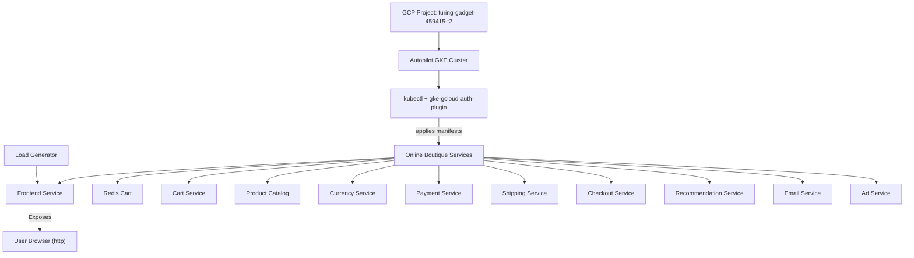

# ☁️ Online Boutique on GKE — "Just Add Cloud Credits"

Welcome to the chaos-controlled deployment guide for **Online Boutique** — Google's microservices demo application. This is a real-world, 12-service e-commerce app built to stress-test your infrastructure skills.  
This guide walks through deploying the project on **Google Kubernetes Engine (GKE)** with a heavy dose of command-line magic and Kubernetes cautionary tales.

---

## 📚 Project Summary

This document captures the exact sequence of events — both triumphant and tragic — involved in spinning up **Online Boutique** on a GCP-hosted Kubernetes cluster.

What you’ll learn:

- How to navigate `gcloud`, `kubectl`, and rogue `k3s` configurations
- How to avoid surprise billing
- And how to finally get the frontend running without summoning nether demons

Because nothing says “production-ready” like 12 pods and a mystery IP that doesn’t load.

---

## 🧩 Features

🛠️ **GCP-Native Deployment**  
Setup uses GKE Autopilot clusters with regional scope and project-level isolation.

🐙 **Multi-Service Madness**  
Deploys 12+ microservices including frontend, cart, checkout, recommendation, email, Redis, and more.

🧠 **Resilience Through Debugging**  
Troubleshooting `kubectl`, haunted kubeconfigs, and hidden defaults.

📦 **CLI-First Approach**  
No portals. Just `kubectl`, YAML, and lots of prayer.

🧹 **Safe Teardown Procedures**  
Stop the billing clock with precise cluster deletion instructions.

---

## 🧠 Architecture Diagram



   
---

## 🗂 Folder Structure (Key Components Only)

```
online-boutique-demo/
├── src/                  # Microservice source code
│   └── frontend/         # Includes Go code, HTML templates, static assets
├── release/              # Kubernetes manifests (monolithic YAML)
│   ├── kubernetes-manifests.yaml
│   └── istio-manifests.yaml
├── helm-chart/           # Helm templating for services
├── kustomize/            # Components and overlays (Istio, Memorystore, etc.)
├── terraform/            # Optional IaaC for infra provisioning
├── cloudbuild.yaml       # Google Cloud Build config
└── skaffold.yaml         # Local development with Skaffold
```

> Also includes `/docs` and `/protos`, but feel free to ignore unless you’re feeling adventurous.

---

## 🧪 Usage Instructions

> CLI or bust. GUIs are for billing alerts.

### 1. 🧰 Install GCloud CLI

```bash
curl -O https://dl.google.com/dl/cloudsdk/channels/rapid/downloads/google-cloud-cli-linux-x86_64.tar.gz
tar -xf google-cloud-cli-linux-x86_64.tar.gz
./google-cloud-sdk/install.sh --usage-reporting=false --path-update=true
```

### 2. 🧺 Clone the Repository

```bash
git clone https://github.com/raoz0r/online-boutique-demo.git
cd online-boutique-demo
```

### 3. 🔧 Configure Project and Region

```bash
export PROJECT_ID=turing-gadget-459415-t2
export REGION=europe-west6

gcloud services enable container.googleapis.com --project=${PROJECT_ID}
```

> ⚠️ Use `gcloud projects describe <project>` if unsure.

---

### 4. 🚀 Create Cluster & Authenticate

```bash
gcloud container clusters create-auto online-boutique --project=${PROJECT_ID} --region=${REGION}
gcloud components install gke-gcloud-auth-plugin
gcloud container clusters get-credentials online-boutique --region=${REGION}
```

> If `kubectl` connects to `127.0.0.1:6443`, check for `/etc/rancher/k3s/k3s.yaml`. Delete and reset `~/.kube/config`.

---

### 5. 🧙‍♂️ Deploy the Online Boutique

```bash
kubectl apply -f ./release/kubernetes-manifests.yaml
kubectl get pods --watch
```

### ✅ Verify Deployment

```bash
kubectl get service frontend-external
kubectl get pods
```

Extract the external IP:

```bash
kubectl get service frontend-external | awk '{print $4}'
```

Visit `http://<EXTERNAL_IP>` in your browser. Yes, it's `http`, not `https`.

---

## 🧼 Clean Teardown (Before Google Charges You)

```bash
gcloud container clusters delete online-boutique --region=europe-west6

# Optional clean-up
gcloud compute addresses list
gcloud compute instances list
```

---

## 🔗 Useful Resources

- [Install GCloud CLI](https://cloud.google.com/sdk/docs/install)
- [GKE API Enablement](https://console.cloud.google.com/apis/library/container.googleapis.com)
- [GKE kubectl Auth Plugin](https://cloud.google.com/kubernetes-engine/docs/how-to/cluster-access-for-kubectl#install_plugin)
- [Online Boutique Repo](https://github.com/GoogleCloudPlatform/microservices-demo)

---

## 🍼 Notes & Reflections

- If `kubectl` routes you to the wrong API server, you're not hallucinating — check your kubeconfig.
- Helm, Kustomize, Istio, Terraform... it's all here if you want to explore further    .
- LICENSE: This is a documentation & learning artifact. Use freely, no license required.

> “When `kubectl get pods` returns 12/12 Running, you feel like a god.  
> When the frontend IP returns 403 — welcome to Kubernetes.”

## License

This repository is for learning and documentation purposes. No license restrictions apply.

---

Generated by Agent TL;DR v0.0.1  
:: Documentation unit booted under Project ARGUS  
:: Status: markdown_verbosity module = FULL SEND  
"Summarizes everything. Writes too much."
